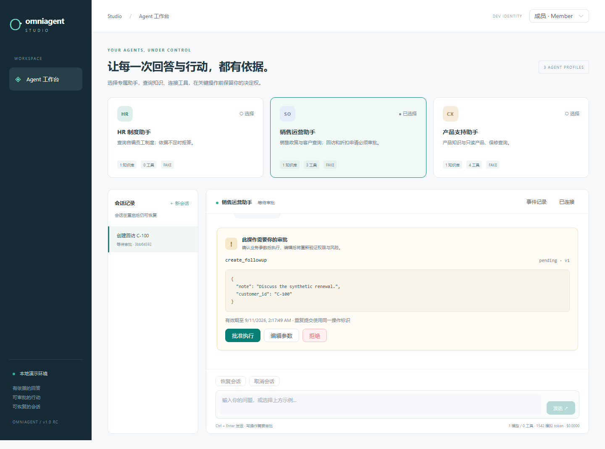
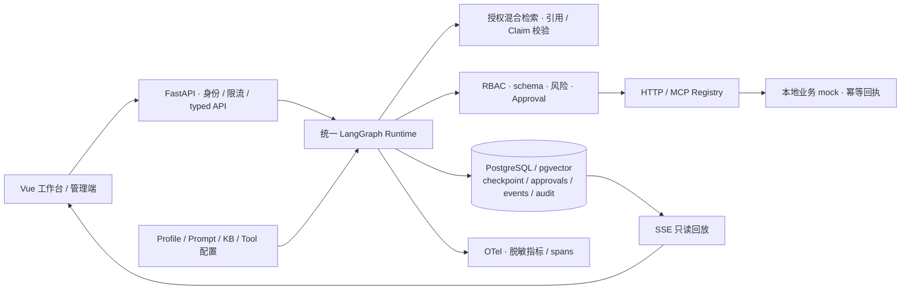
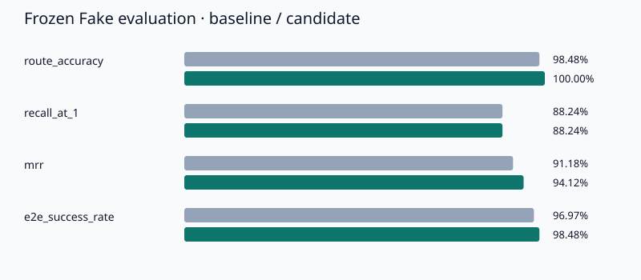

# OmniAgent Studio

**把企业知识问答和需要人工批准的业务操作，放进同一个可配置、可恢复、可审计的 Agent Runtime。**

Vue 3 · TypeScript · FastAPI · LangGraph · PostgreSQL / pgvector · HTTP / MCP

适合展示制度查询、产品支持和销售运营中的工程闭环：找到证据、展示引用、提出工具调用、等待批准、安全执行，并在重启或断线后恢复。默认使用确定性的 Fake Provider 和本地业务 mock，不需要模型密钥。



| 预置 Agent | 独立知识库 | 工具与执行策略 |
| --- | --- | --- |
| HR 制度助手 | 年假、差旅、报销 | 无业务工具；有依据才回答，引用可定位 |
| 产品支持助手 | 产品、保修、故障排查 | 产品与保修查询自动执行；包含 HTTP 和 MCP |
| 销售运营助手 | 跟进、折扣、客户政策 | 客户查询只读；创建回访、申请折扣均须审批和幂等键 |

三个 Profile 来自同一份 [seed 配置](presets/profiles.json)，运行时没有场景名分支。知识库、工具 allowlist、角色、Prompt、上下文和预算共同决定行为。

## 5 分钟 Quickstart

前提：Git、Python 3.12、可运行 Linux 容器的 Docker Engine / Docker Desktop 与 Compose v2+。Windows 使用 PowerShell；macOS/Linux 可将 `python` 替换为 `python3`。首次下载镜像和依赖的时间取决于网络，可能超过五分钟。

在干净 checkout 的仓库根目录执行：

```sh
python scripts/ops.py bootstrap
python scripts/ops.py health
```

打开 **http://127.0.0.1:8080**。启动命令会完成 build → PostgreSQL → migration → seed → mock / API → Web，并等待 readiness。无需安装本机 Node、PostgreSQL 或提供模型 key。重复 seed 不重复创建数据。

```sh
python scripts/ops.py seed
python scripts/acceptance.py --output .pytest-tmp-demo
python scripts/ops.py down
```

`down` 保留数据库卷；再次 `up` 可恢复会话和待审批任务。只有显式 `reset --confirm-reset` 才会删除指定项目的卷，详见 [部署操作](docs/operations.md)。默认项目名 `omniagent-v1`，Web 仅绑定 loopback；演示身份和数据库口令都是公开的本地测试凭据。

## 立即演示

1. 选择 HR，发送 `年假 leave allowance`，点击引用；再问 `月球基地停车费是多少`，观察无证据拒答。
2. 选择产品支持，发送 `产品查询 P-100`、`保修查询 SN-100`、`MCP 产品 P-200`，观察只读调用。
3. 选择销售运营，发送 `创建回访 C-100`。审批卡出现后刷新页面、恢复会话，编辑 `customer_id` 和 `note`，再批准。
4. 重复提交同一个审批决策，效果账本仍只有一次写入；SSE 断线重连只读取已有事件。
5. 右上角切换管理员，查看 Profile、知识库、工具风险、Prompt 版本和配置验证。

[完整 3–5 分钟脚本](docs/demo.md) · [可重复验收脚本](scripts/acceptance.py) · [架构与状态图](docs/architecture.md)

## 工程实现

- **持久化与恢复**：PostgreSQL checkpoint、会话所有权、schema 版本、TTL、sliding window 和有界摘要；每次尝试先持久化预算，恢复不会获得新预算。
- **可审批行动**：LangGraph interrupt/resume，approve / edit / reject / expire；编辑重新验证参数和权限；乐观版本、决策哈希、会话锁及下游幂等回执防并发和重放。
- **受控连接器**：固定 HTTP origin / port / path / method / headers，防 SSRF、重定向和 DNS 重绑定；MCP tools/resources 发现后进入同一个 Registry；支持受限 OpenAPI 3 子集导入。
- **可信输出边界**：先做 KB 授权再检索排序；验证引用身份、原文、Claim 支持和覆盖；文档、历史、摘要和工具结果都视为不可信数据。
- **浏览器闭环**：统一 typed API client、SSE 状态与答案分片、sequence / event_id 去重、内部引用定位和审批恢复；不用浏览器存储保存真实密钥。
- **可靠性与可观测性**：分层 typed errors、有 deadline 的退避与 jitter、熔断、受控多 Provider 降级；OpenTelemetry 关联 API / LLM / retrieval / tool / approval / SQL，日志不记录原始 Prompt 或隐藏推理。
- **权限安全的缓存**：只缓存检索证据，完整版本与权限命名空间、短 TTL、每次命中重新验证证据；不缓存写操作。



## 当前可复核指标

下表的 Fake 评测来自当前干净环境，原始输出、门禁与镜像身份集中在 [Release 验收证据](docs/artifacts/release/README.md)。优化实验和真实 Provider 基线分别记录。Fake tokens 是保守的 UTF-8 字节估算，不能与真实 Provider token 单价比较。安全指标独立设 gate，不能被平均分抵消。

| 指标 | 当前证据 |
| --- | --- |
| 后端 / 前端 unit / 浏览器 E2E | 577 / 18 / 4 通过，0 跳过，浏览器不重试 |
| 后端行覆盖率 | 5,230 / 6,083 = 85.98%，门槛 80% |
| 独立安全门禁 | 74 项通过，16 条版本化对抗场景 |
| 统一评测数据 | 66 条；dev/test 各 33；三个 Profile 各 22 |
| Fake E2E / route accuracy | 65/66（98.48%）/ 100% |
| Recall@1 / @3 / @5；MRR | 88.24% / 100% / 100%；0.9412 |
| 已输出引用有效率 / Claim 支持率 | 100% / 100%（16 个有引用结果） |
| 无依据拒答判定；工具选择；参数字段 F1 | 96.43%；100%；1.0 |
| 未授权写入 / 跨 KB 命中 / 攻击成功 | 0 / 0 / 0，均独立通过 |
| Fake eval P50 / P95 | 141.61 / 329.39 ms |
| Fake 调用 / token / 成本 | 模型 94、检索 28、工具 18；165,505；$0 |
| 优化实验，20 次同工作负载 | 平均 SQL 148 → 118；P50 246.79 → 216.89 ms |
| 真实模型独立小样本 | 3 条、E2E 2/3；6 次模型调用，6,697 tokens；成本 unknown |

[当前 Fake 原始报告](docs/artifacts/release/eval/report.md) · [冻结 baseline / candidate](docs/artifacts/eval-comparison/comparison.md) · [性能与 EXPLAIN](docs/artifacts/benchmark-comparison/comparison.md) · [真实 Provider 原始结果](docs/artifacts/real-provider/report.md) · [失败案例](docs/failures-and-limitations.md)



## 测试、评测与安全

容器内后端 coverage 门槛为 80%；真实 Provider 不属于默认 CI 前提。

```sh
python scripts/ops.py test
python scripts/ops.py eval
python scripts/ops.py benchmark
```

报告写入 `.pytest-tmp-container-reports/`。以下本机门禁需要先按 [开发文档](docs/development.md) 设置两个测试数据库环境变量：

```sh
python -m pip install uv==0.12.1
uv --cache-dir .uv-cache sync --locked
uv --cache-dir .uv-cache run ruff check .
uv --cache-dir .uv-cache run ruff format --check .
uv --cache-dir .uv-cache run mypy src/omniagent
uv --cache-dir .uv-cache run omniagent security --output .pytest-tmp-security
```

本机数据库、全部门禁和浏览器截图命令见 [开发与验收](docs/development.md)。CI 包含 PostgreSQL service container、后端静态检查与 coverage、Vue lint/typecheck/unit/build、Docker smoke 和 Chromium E2E，保留 JUnit / coverage / eval artifacts。真实模型只能手动触发独立 workflow。

## 配置、边界与发布

真实 Provider 由服务端环境变量引用配置，默认关闭；可选配置和 OTLP / Langfuse 说明见 [部署操作](docs/operations.md)。工具端点只能由可信管理员预先登记，模型不能选择任意 URL、方法、SQL、shell 或 Python。

这是面向本地作品展示的单机系统：开发身份不是 SSO，没有企业组织多租户、真实 CRM / 邮件 / 支付写入或分布式 exactly-once 保证。当前 Fake 检索与严格 Claim 校验的适用范围、已知失败和后续路线见 [限制与改进](docs/failures-and-limitations.md)。

[威胁模型](docs/threat-model.md) · [ADR](docs/adr/) · [数据许可](docs/data-license.md) · [CHANGELOG](CHANGELOG.md) · [Release notes](docs/releases/v1.0.0-rc.1.md) · [MIT License](LICENSE)
