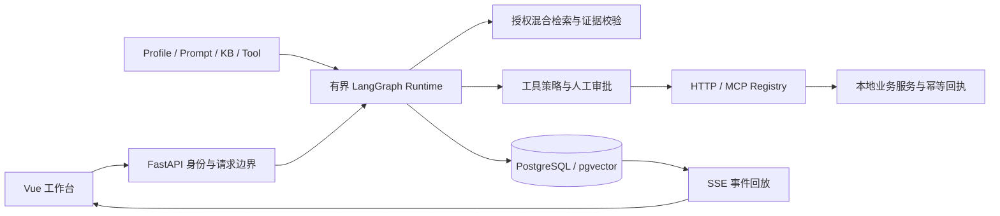

# OmniAgent Studio

**可配置的知识问答与审批 Agent 平台：查询有出处，写操作先批准，会话可以恢复。**

Vue 3 / TypeScript · FastAPI · LangGraph · PostgreSQL / pgvector · HTTP / MCP

[界面与源码导览](docs/showcase.md) · [演示流程](docs/demo.md) · [设计文档](docs/architecture.md) · [验证记录](docs/delivery-v1.md)

面向制度查询、产品支持和销售运营场景。三套 Profile 共用一个 Runtime，通过配置选择知识库、工具、权限和预算。支持真实 DeepSeek 模型与智谱 embedding-3；无密钥 Fake 模式用于离线复现和 CI。业务数据与写入均使用本地沙箱，暂无公开体验站点。


| Profile | 一条可演示的流程 |
| --- | --- |
| HR 制度助手 | 查询年假政策 → 回答并定位原文；没有依据时拒答 |
| 产品支持助手 | 查询产品或保修 → HTTP / MCP 只读工具 → 展示结果 |
| 销售运营助手 | 客户查询 → 回访或折扣提案 → 编辑 / 批准 / 拒绝 → 执行回执 |

## 关键设计

- **知识与权限一起检索**：先限定 Profile 的知识库，再执行全文、向量检索和 RRF。模型选择完整证据单元，服务端验证引用身份并重建回答，防止摘取片段时省略否定或条件。
- **批准与执行分开**：LangGraph interrupt/resume 保存待审批任务；参数编辑后重新校验 Schema、角色、工具策略。版本、决策哈希和下游幂等回执共同约束重复批准与响应丢失。
- **恢复保留原约束**：PostgreSQL 保存 checkpoint、预算和事件。运行中可请求取消；SSE 回放状态和校验后的答案片段，重连不会重新调用工具。
- **变更可以追溯**：独立账号、可撤销登录、服务端限流、配置与权限的事务审计；外部调用有 deadline、受控重试和熔断。OpenTelemetry 关联模型、检索、工具与数据库操作。



## 快速启动

需要 Git、Python 3.12 和支持 Linux 容器的 Docker / Compose。首次构建需要下载镜像和依赖。

```sh
git clone https://github.com/jason4166/omniagent-studio.git
cd omniagent-studio
python scripts/ops.py bootstrap --mode fake
python scripts/ops.py health --mode fake
```

打开 **http://127.0.0.1:8080**，用启动命令提示的私有初始账号文件登录。启动包含构建、数据库迁移、可重复 seed 和 readiness 检查。

**首次创建真实模式**：在运行命令的终端配置 `DEEPSEEK_API_KEY` 与 `ZHIPUAI_API_KEY`，执行：

```sh
python scripts/ops.py bootstrap --mode real --port 8081
```

首次按此命令创建的项目打开 `http://127.0.0.1:8081`。密钥通过私有文件引用传入容器，两个模式使用独立项目和索引。

**已有真实模式部署**：在仓库根目录执行下面的命令，自动使用已保存的密钥和端口：

```sh
python scripts/ops.py up --mode real
python scripts/ops.py health --mode real
```

访问 `.local/deployments/omniagent-secure-real/deployment.json` 中的 `origin` 地址；如果原来部署在 `8080`，就继续打开 `http://127.0.0.1:8080`。`--port 8081` 只适用于首次创建；已有项目的端口不同会报 `The local port must match the project's pinned origin`，这时省略 `--port` 即可。登录账号在同目录的 `admin.json`，只在本机查看。

停止使用 `python scripts/ops.py down --mode fake`，数据库卷保留。公网 HTTPS、账号初始化及备份见 [部署说明](docs/public-deployment.md)；详细命令见 [操作手册](docs/operations.md)。

需要免填账号的访问入口时，在 `bootstrap` 或 `up` 命令后加 `--public-preview`。登录页会预填公开体验账号；每位访客获得独立身份，可以使用获授权助手，并只读查看关联的后台配置。创建助手、上传文档、修改配置和账号管理仍需管理员。开关随部署保存，关闭使用 `up --no-public-preview`，已有真实部署同时保留 `--mode real`。详见 [访问权限与展示配置](docs/public-deployment.md#管理只读与公开登录)。

## 试用流程

1. HR：问“今年有多少天带薪年假？”，点击引用；再问“月球基地停车费是多少？”查看拒答。
2. 产品：输入“产品查询 P-100”“保修查询 SN-100”“MCP 查询 P-200”。
3. 销售：输入“为客户 C-100 创建回访，备注：确认续约需求”；刷新恢复审批，修改备注并批准。
4. 按 [验收脚本](scripts/acceptance.py) 检查重复批准、服务重启和事件回放；完整演示说明见 [demo](docs/demo.md)。

## 开发与验证

```sh
python scripts/ops.py bootstrap --mode fake --project omniagent-test-check --port 8082 --test-accounts
python scripts/ops.py test --mode fake --project omniagent-test-check
python scripts/ops.py eval --mode fake --project omniagent-test-check
python scripts/ops.py benchmark --mode fake --project omniagent-test-check
```

[开发文档](docs/development.md) 包含后端静态检查、覆盖率、前端测试、浏览器 E2E、安全扫描和截图命令。CI 使用独立 PostgreSQL 和 Fake Provider；真实模型评测单独手动运行。

测试结果、评测分母和已知失败集中在 [版本化验证记录](docs/delivery-v1.md)。测试覆盖率反映代码执行范围；小型固定评测集不能代替通用回答准确率或线上 SLA。历史结果按原版本保留。

## 范围与限制

- HTTP / MCP 连接器演示固定本地业务协议，未接入真实 CRM、邮件或支付写入。幂等保证依赖下游事务回执。
- 回答采用完整检索片段提取，可能拒绝合理改写；完整片段也不保证涵盖源文档其他位置的条件或例外。
- 缓存是保守的查询规范化证据缓存，保留语序并验证权限与版本，不是通用语义答案缓存。
- SSE 在校验完成后发送答案片段；公网部署仍需在目标服务器验收 DNS、TLS、备份和监控。

[失败与改进](docs/failures-and-limitations.md) · [威胁模型](docs/threat-model.md) · [ADR](docs/adr/) · [数据许可](docs/data-license.md) · [CHANGELOG](CHANGELOG.md) · [MIT](LICENSE)
