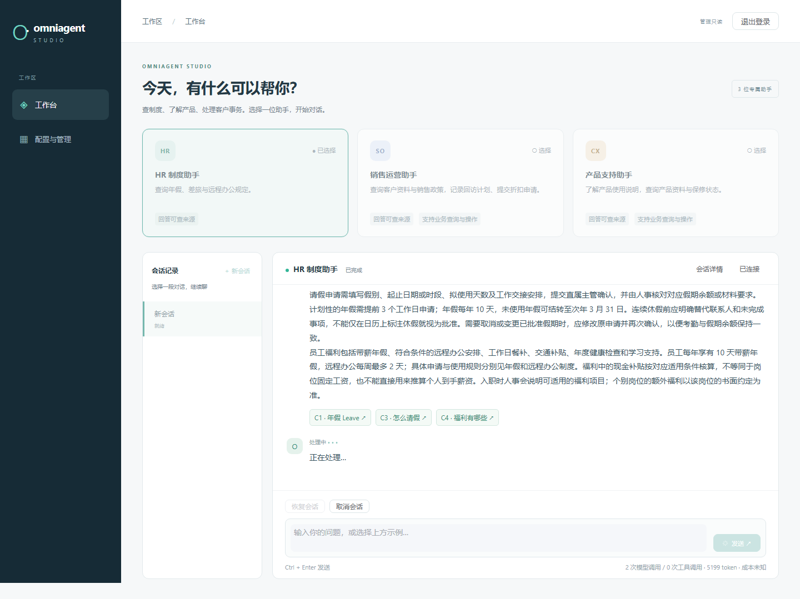
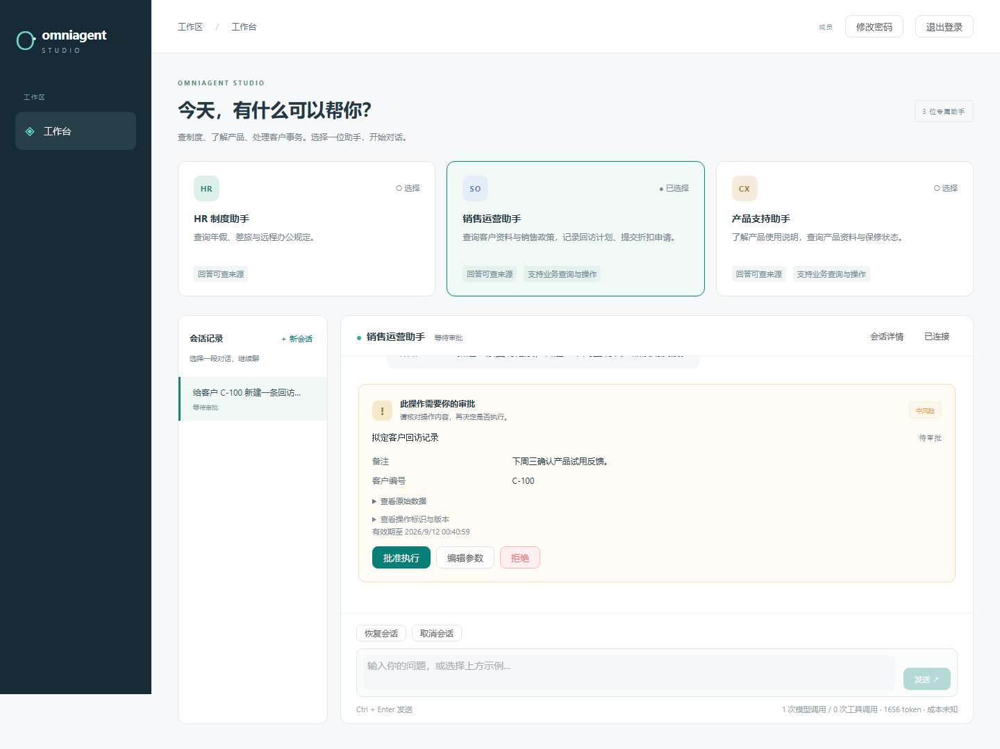
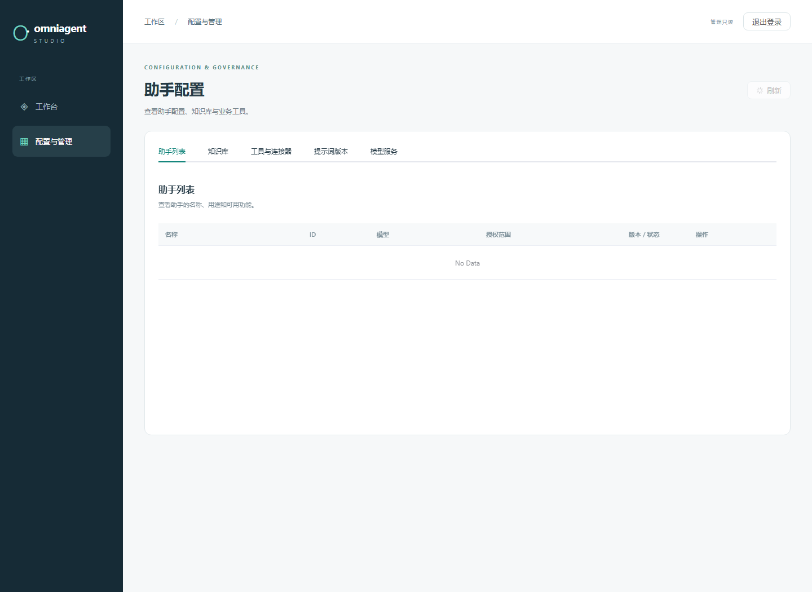
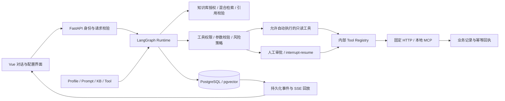
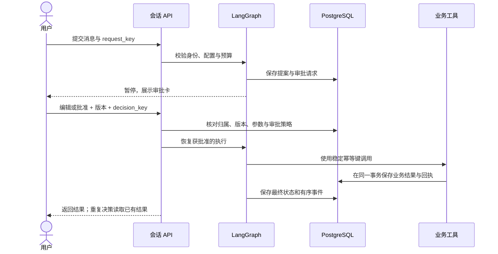

# OmniAgent Studio

**面向知识查询与业务审批的 Agent 应用：从带引用的回答，到可确认、可追溯、可恢复的操作。**

Python / FastAPI · LangGraph · PostgreSQL / pgvector · Vue 3 / TypeScript / Element Plus · HTTP / MCP

[快速启动](#快速启动) · [场景与功能](#场景与功能) · [工程设计](#工程设计) · [验证与复现](#验证与复现) · [部署说明](docs/public-deployment.md)

OmniAgent Studio 把知识检索、工具调用、人工审批和会话恢复放进同一套配置驱动的 Runtime。管理员配置助手可使用的知识库、工具和权限；用户通过对话查询资料、处理业务提案，并在关键操作执行前确认或修改参数。

**访问状态（2026-09-12）**：已完成云服务器内部部署与验收。计划使用的域名 `omniagentstudio.top` 正在进行 ICP 备案前的准备与咨询，尚未提交审核，公网体验入口暂未开放。当前可通过下面的本地启动方式体验，云端验证结果见 [部署验收记录](docs/cloud-deployment-2026-09-12.md)。



## 场景与功能

三套预置助手共用同一个 Runtime，只通过 Profile、知识库和工具配置区分场景。

| 助手 | 知识范围 | 业务工具 | 可以体验的流程 |
| --- | --- | --- | --- |
| HR 制度助手 | 年假、薪资福利、考勤、入职、差旅与远程办公 | 不开放业务工具 | 提问 → 检索制度 → 回答并定位引用原文；资料未覆盖时说明无法确认 |
| 产品支持助手 | 产品选型、日常使用、故障排查、保修与售后流程 | `lookup_product`、`check_warranty`、MCP 产品查询及资源读取 | 识别需求 → 查询产品或保修记录 → 展示工具结果 |
| 销售运营助手 | 客户接洽、报价、跟进、交接与折扣政策 | `lookup_customer`、`create_followup`、`request_discount` | 查询客户 → 提出回访或折扣操作 → 编辑 / 批准 / 拒绝 → 查看执行回执 |

预置知识与业务记录为仓库维护的合成数据，内容许可和范围见 [知识库说明](docs/knowledge-content.md) 与 [数据许可](docs/data-license.md)。对话支持真实 DeepSeek API，向量检索使用智谱 embedding；业务工具连接受控的本地服务，不接入实际 CRM、邮件或支付系统。

### 对话工作台

- 选择助手、创建会话、查看历史，以及恢复或取消未完成的任务。
- 通过 SSE 接收运行进度与校验后的答案片段，断线后按事件游标继续接收。
- 点击回答中的引用查看资料标题和相关原文，不向用户展示切块参数或内部元数据。
- 展示工具提案、业务参数和审批状态；写操作经过人工确认后执行。
- 保留调用次数、token 用量和成本信息；未配置价格时成本显示 `unknown`。



### 配置与管理

- **助手**：创建、编辑、校验及导入 / 导出 Profile，配置模型、Prompt、知识库、工具、审批策略、上下文与预算。
- **知识库**：创建知识库，上传 PDF / Markdown / TXT，查看解析、索引状态和资料内容。
- **工具与连接器**：查看参数和返回值 Schema、角色、风险等级及审批要求，在预批准的适配器契约内管理工具定义。
- **Prompt 与模型服务**：管理提示词版本，查看模型配置状态；密钥由服务端管理，浏览器不接收真实密钥。
- **账号与审计**：管理员管理账号、Profile 授权及配置变更记录；权限由服务端校验。



### 账号与访问权限

| 身份 | 工作台 | 管理端 |
| --- | --- | --- |
| 管理员 `admin` | 使用被启用且允许其角色的助手，仍受工具与审批规则约束 | 管理配置、账号及全局审计 |
| 成员 `member` | 使用获授权助手；按策略调用工具、审批自己会话的提案 | 不开放配置管理 |
| 查看者 `viewer` | 使用获授权且允许该角色的助手；默认预置业务工具不授予此角色 | 不开放配置管理 |
| 管理只读 `reviewer` | 具备获授权助手的成员业务权限，包括审批自己的提案 | 只读查看关联配置，不能修改配置、管理账号或读取全局审计 |

可以显式开启预填登录入口。每位独立访客获得自己的临时身份和会话；同一公开入口不共享聊天记录或审批权限。临时身份有有效期，公开访客合计调用量也受服务端限额约束。

管理员账号由首次启动自动生成，其他持久账号由管理员创建；没有开放注册接口。完整规则见 [访问权限与展示配置](docs/public-deployment.md#管理只读与公开登录)。

## 工程设计

### 一套有界 Runtime

Profile 是配置，场景名称不决定另一套执行分支。模型负责意图识别、澄清与工具提案，服务端负责验证权限、参数、证据、预算和执行条件。



LangGraph 使用 PostgreSQL checkpoint。状态只保留有界领域数据和计数，不保存 Provider 客户端、数据库连接或密钥。运行同时受节点步数、调用次数、token 和有效执行时间限制；恢复任务不会重新获得一份预算。

### 检索与引用

文档导入后保留来源、标题和定位信息。检索先限定当前 Profile 允许访问的知识库，再执行 PostgreSQL 全文检索、pgvector 向量检索及 RRF 排序融合。

回答采用完整证据单元选择与服务端重建：验证引用身份、知识库权限、来源、校验和及证据覆盖，再输出答案。它有助于避免模型改写时漏掉原文条件，但仍可能返回偏长片段，或遗漏其他片段中的例外条件。证据缓存按 Profile、Prompt、知识库、模型、权限及依赖版本分区，命中后再次校验。

### 审批、幂等与恢复

写工具先生成持久化审批请求，再通过 LangGraph 暂停执行。批准、编辑后批准、拒绝及过期都有明确状态；编辑后的参数重新进行 Schema、权限和风险校验。



重复点击、并发审批、响应丢失和重启恢复均使用持久化版本、请求标识与回执约束。当前保证建立在本地业务服务的幂等事务上，不能直接推导为任意外部系统的“恰好执行一次”。SSE 读取持久化事件，不触发新的工具执行。

### 连接器与可靠性

HTTP 连接器由管理员固定主机、端口、路径、GET / POST 方法和请求头，模型只提交经过 Schema 验证的业务参数。重定向、目标地址、超时、响应大小及内容类型均受限制。

MCP 使用固定的本地 stdio server，发现的工具与资源通过内部 Registry 使用。OpenAPI 导入仅接受与预批准适配器契约一致的子集，不会把任意 URL 或接口自动开放给模型。

外部调用使用统一错误类型、超时、指数退避、抖动与熔断；认证、权限和坏 Schema 不重试。可显式配置第二个 Provider 处理符合策略的瞬时故障，每次尝试仍计入预算。当前云端使用单个对话 Provider，双 Provider 降级是可选配置。

### 安全与可观测性

用户输入、知识文档和工具返回值均作为不可信数据处理。服务端组合检查会话归属、角色、Profile、知识库、工具风险及审批策略，并限制登录、上传、请求、模型调用和 SSE 并发。

OpenTelemetry 关联 API、图节点、模型、检索、工具、审批和 SQL；异常路径也会结束 span。配置与账号变更和脱敏审计同事务提交，日志及 trace 不保存密钥、完整 Prompt 或隐藏推理。OTLP 导出可以关闭；本地指标为进程内观测，持久化审计、预算和会话保存在数据库。

进一步阅读：[完整状态图与数据关系](docs/architecture.md) · [威胁模型](docs/threat-model.md) · [设计决策 ADR](docs/adr/) · [源码导览](docs/showcase.md)

## 快速启动

需要 **Git、Python 3.12、支持 Linux 容器的 Docker / Docker Compose**。首次构建会下载镜像和依赖；通过 Docker 启动不需要本机安装 Node 或 PostgreSQL。

### 无密钥运行

```sh
git clone https://github.com/jason4166/omniagent-studio.git
cd omniagent-studio
python scripts/ops.py bootstrap --mode fake --public-preview
python scripts/ops.py health --mode fake
```

打开 **http://127.0.0.1:8080**，直接使用预填登录入口。启动命令包含镜像构建、数据库迁移、可重复 seed、账号初始化和 readiness 检查。

Fake 模式可运行知识查询、HTTP/MCP 工具、审批与恢复流程，模型及向量由离线实现提供，适合检查交互和工程行为，不代表真实模型的语言能力。

需要编辑配置时，使用启动命令提示的私有 `admin.json` 文件中的管理员账号。该文件在你的电脑上生成，不在 Git 仓库中；其他持久账号可登录管理员后在“账号与访问”中创建。

### 使用真实模型

在启动终端中配置两个环境变量：

| 变量 | 用途 |
| --- | --- |
| `DEEPSEEK_API_KEY` | 对话模型 API |
| `ZHIPUAI_API_KEY` | embedding-3 向量 API |

<details>
<summary>Windows PowerShell：隐藏输入密钥并首次启动</summary>

在仓库根目录执行。真实密钥通过隐藏输入读取，不写入命令历史；调用费用由对应 API 账户承担。

```powershell
$env:DEEPSEEK_API_KEY = [System.Net.NetworkCredential]::new('', (Read-Host 'DeepSeek API Key' -AsSecureString)).Password
$env:ZHIPUAI_API_KEY = [System.Net.NetworkCredential]::new('', (Read-Host 'Zhipu API Key' -AsSecureString)).Password
try {
    python scripts/ops.py bootstrap --mode real --port 8081 --public-preview
} finally {
    Remove-Item Env:DEEPSEEK_API_KEY, Env:ZHIPUAI_API_KEY -ErrorAction SilentlyContinue
}
```

</details>

Linux / macOS 或已安全注入环境变量的终端执行：

```sh
python scripts/ops.py bootstrap --mode real --port 8081 --public-preview
python scripts/ops.py health --mode real
```

首次按上述命令创建的真实模式入口为 **http://127.0.0.1:8081**。密钥首次初始化时保存为私有文件引用并只读挂载到容器，不进入网页、Profile 或镜像。Fake 与真实模式使用独立项目、数据库卷和索引；自部署者使用自己的 API 与账号。

### 重启与停止

已有真实模式部署直接执行：

```sh
python scripts/ops.py up --mode real
python scripts/ops.py health --mode real
```

`up` 自动恢复已保存的密钥引用、端口和公开入口设置。已有部署不重复指定新端口：浏览器使用 `.local/deployments/omniagent-secure-real/deployment.json` 中的 `origin`，原来在 8080 的部署仍使用 8080。

需要停止服务时单独执行，数据库卷保留：

```sh
python scripts/ops.py down --mode real
```

### 体验一条完整流程

1. 选择 HR，问“今年有多少天带薪年假？”，点击引用查看原文；继续问“怎么申请？”查看多轮上下文。
2. 问“月球基地停车费是多少？”，检查系统能否说明资料未覆盖。
3. 选择产品支持，输入“产品查询 P-100”“保修查询 SN-100”或“MCP 查询 P-200”。
4. 选择销售运营，输入“为客户 C-100 创建回访，备注：确认续约需求”，查看提案，编辑参数并批准。
5. 刷新页面恢复会话，查看审批结果与事件记录；自动化验收会进一步检查重启、重复批准及 SSE 重连。

Fake 模式建议使用上述带明确主题的示例；自然表达和话题切换请用真实模式体验。完整演示见 [演示脚本](docs/demo.md)。

## 验证与复现

仓库把离线回归、真实模型评测和实际部署验收分开记录。验证结果包含源码、数据集、配置和模型版本，不用一个平均分替代知识库隔离、越权写入等独立安全门禁。

| 层次 | 检查内容 | 入口 |
| --- | --- | --- |
| 单元 / 契约 | 参数 Schema、上下文、权限、引用、错误与重试策略 | [tests](tests/) |
| 集成 / 安全 | PostgreSQL、checkpoint、审批并发、故障恢复与攻击用例 | [开发门禁](docs/development.md)、[安全数据](security/) |
| 浏览器 E2E | 登录隔离、只读管理、引用、HTTP/MCP、审批及重连 | [Playwright](apps/web/e2e/) |
| 评测 | 路由、检索、引用、工具、拒答、独立安全 gate 与调用消耗 | [评测口径](evals/measurement-methods.md)、[自然问法数据](evals/knowledge-v1/) |
| 性能实验 | 固定负载、trace、SQL EXPLAIN 与基线 / 候选复测 | [SQL 优化记录](docs/artifacts/benchmark-comparison/comparison.md) |
| 部署验收 | 新卷启动、两次整机重启、审批幂等、加密备份恢复与镜像扫描 | [云端验收](docs/cloud-deployment-2026-09-12.md) |

创建专用测试环境，不在保留业务数据的数据库上运行评测：

```sh
python scripts/ops.py bootstrap --mode fake --project omniagent-test-check --port 8082 --test-accounts
python scripts/ops.py test --mode fake --project omniagent-test-check
python scripts/ops.py eval --mode fake --project omniagent-test-check
python scripts/ops.py benchmark --mode fake --project omniagent-test-check
```

GitHub Actions 执行后端测试、Ruff、mypy、Vue lint / typecheck / test / build、Docker 和浏览器检查，使用 PostgreSQL 服务与 Fake Provider。真实模型检查仅手动触发，不要求贡献者提供付费密钥。JUnit、覆盖率及评测结果随运行归档。

当前与历史结果集中在 [版本化验证记录](docs/delivery-v1.md)。其中保留已知失败、测试分母和测量环境；固定数据集结果不是通用回答准确率，历史本机延迟也不是云端 SLA。

## 部署与运维

Docker Compose 包含 Web、API、PostgreSQL / pgvector、本地业务服务、migration 和 seed；正式配置提供 Caddy HTTPS 入口。服务端通过私有文件加载秘密，应用使用独立数据库角色，运行容器使用非 root 用户。

目前云端已验证新数据库卷启动、真实模型调用、会话与审批恢复、加密备份恢复及端口限制。**域名处于备案准备阶段，公开 DNS、TLS 和外部监控尚未完成验收。** 不把本地地址或 SSH 转发地址作为公共体验链接。

公网配置、预构建镜像传输、账号恢复、TTL 清理和备份命令见 [部署与账号运维](docs/public-deployment.md)；日常启动、停止及环境隔离见 [操作手册](docs/operations.md)。

## 已知限制与后续方向

- **证据回答**：采用完整证据片段提取，可能较长或遗漏跨片段条件；后续改进检索与证据组织，保持引用可核验。
- **业务集成**：HTTP/MCP 使用预批准的本地接口，真实 CRM、邮件和支付写入未接入；扩展写工具需要等价的下游幂等契约。
- **缓存与流式输出**：当前是保守的证据缓存和校验后分片输出，不是任意语义答案缓存或原始模型 token 直传。
- **运行规模**：面向单实例部署，未提供多组织租户、SSO/MFA、消息队列或集群高可用，也未声明生产并发容量。
- **公开运营**：继续完成域名备案适用性确认、正式 HTTPS、外部健康监控和定期异地备份；已有内部验收不替代这些步骤。

[失败案例与改进](docs/failures-and-limitations.md) · [ADR](docs/adr/) · [CHANGELOG](CHANGELOG.md) · [MIT 许可](LICENSE)
