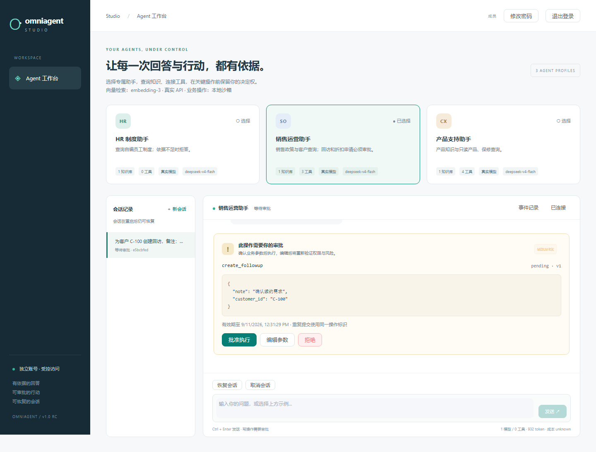
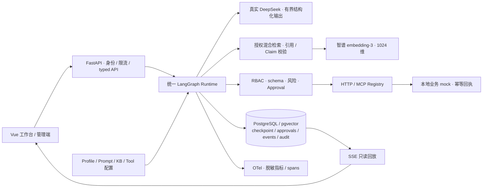

# OmniAgent Studio

**把企业知识问答和需要人工批准的业务操作，放进同一个可配置、可恢复、可审计的 Agent Runtime。**

Vue 3 · TypeScript · FastAPI · LangGraph · PostgreSQL / pgvector · HTTP / MCP

[项目展示与截图](docs/showcase.md) · [3–5 分钟演示](docs/demo.md) · [架构与源码入口](docs/showcase.md#源码与验证入口) · [验证报告](docs/artifacts/release-public/README.md)

适合展示制度查询、产品支持和销售运营中的工程闭环：找到证据、展示引用、提出工具调用、等待批准、安全执行，并在重启或断线后恢复。简历演示配置使用真实 DeepSeek 模型和智谱 embedding-3，支持自然语言规划与真实向量检索；业务操作使用本地沙箱。另保留无密钥的 Fake 模式用于 CI 和离线复现。

这是面向企业场景的个人工程作品。当前提供可运行源码、实际界面截图和版本化验收报告；尚无公开在线体验站点。首次查看可先浏览项目展示页，再选择无密钥复现或真实模型演示。



| 预置 Agent | 独立知识库 | 工具与执行策略 |
| --- | --- | --- |
| HR 制度助手 | 年假、差旅、报销 | 无业务工具；有依据才回答，引用可定位 |
| 产品支持助手 | 产品、保修、故障排查 | 产品与保修查询自动执行；包含 HTTP 和 MCP |
| 销售运营助手 | 跟进、折扣、客户政策 | 客户查询只读；创建回访、申请折扣均须审批和幂等键 |

三个 Profile 来自同一份 [seed 配置](presets/profiles.json)，运行时没有场景名分支。知识库、工具 allowlist、角色、Prompt、上下文和预算共同决定行为。

## 5 分钟 Quickstart

前提：Git、Python 3.12、可运行 Linux 容器的 Docker Engine / Docker Desktop 与 Compose v2+。Windows 使用 PowerShell；macOS/Linux 可将 `python` 替换为 `python3`。首次下载镜像和依赖的时间取决于网络，可能超过五分钟。

仓库地址：<https://github.com/jason4166/omniagent-studio>。截图和验收报告对应 rc.3，复现时请按报告记录的版本核对代码。当前版本的交付范围见 [交付说明](docs/delivery-v1.md)。

**无密钥预览**：在包含本 README 对应代码的仓库根目录执行以下命令。Fake 模式用于验证完整操作流程，模型回答与真实模式分开标识。

```sh
python scripts/ops.py bootstrap --mode fake
python scripts/ops.py health --mode fake
```

打开 **http://127.0.0.1:8080**，使用启动时提示的私有初始账号文件登录。账号凭据不会公开在 README 中。

**真实模型演示**：

真实模式需要在本机进程环境或密钥管理器中提供 `DEEPSEEK_API_KEY` 和 `ZHIPUAI_API_KEY`。密钥值不写进仓库、YAML 或浏览器，Compose 只保存 secret 引用。在干净 checkout 的仓库根目录执行：

```sh
python scripts/ops.py bootstrap --mode real
python scripts/ops.py health --mode real
```

打开 **http://127.0.0.1:8080**，使用启动时提示的 `.local/deployments/omniagent-secure-real/admin.json` 登录。引导密码随机生成；登录后可修改密码，并在账号管理中创建独立访问账号。启动命令会完成 build → PostgreSQL → migration → seed → mock / API → Web，并等待 readiness。无需安装本机 Node 或 PostgreSQL。聊天与 embedding 调用真实 API；重复 seed 不重复创建数据。

```sh
python scripts/ops.py seed --mode real
python scripts/acceptance.py --mode real --project omniagent-secure-real --output .pytest-tmp-demo
python scripts/ops.py down --mode real
```

`down` 保留数据库卷；再次 `up` 可恢复会话和待审批任务。只有显式 `reset --confirm-reset` 才会删除指定项目的卷，详见 [部署操作](docs/operations.md)。真实项目为 `omniagent-secure-real`，Web 默认仅绑定 loopback。账号和数据库凭据每次安装独立生成，没有可用于服务的公共演示 token。无密钥复现可执行 `python scripts/ops.py bootstrap --mode fake`，其独立项目为 `omniagent-secure-fake`，同样需要账号登录。公网使用明确的 HTTPS overlay，见 [公网部署](docs/public-deployment.md)。同时运行时需为第二个项目设置不同的 `OMNIAGENT_WEB_PORT`；切换模式不得共用知识索引。

## 立即演示

1. 选择 HR，发送 `今年有多少天带薪年假？`，点击引用；再问 `月球基地停车费是多少`，观察无证据拒答。
2. 选择产品支持，发送 `产品查询 P-100`、`保修查询 SN-100`、`MCP 产品 P-200`，观察只读调用。
3. 选择销售运营，发送 `为客户 C-100 创建回访，备注：确认续约需求`。审批卡出现后刷新页面、恢复会话，编辑 `customer_id` 和 `note`，再批准。
4. 重复提交同一个审批决策，效果账本仍只有一次写入；SSE 断线重连只读取已有事件。
5. 使用管理员账号登录后查看 Profile、知识库、工具风险、Prompt 版本和配置验证；member/viewer 没有管理入口。

[完整 3–5 分钟脚本](docs/demo.md) · [可重复验收脚本](scripts/acceptance.py) · [架构与状态图](docs/architecture.md)

## 工程实现

- **账号和公网入口**：独立 UUID 账号、Argon2id、可撤销 HttpOnly cookie、CSRF/Origin、持久化额度、数据库最小权限、Caddy TLS 和加密恢复演练；旧演示身份仅用于显式测试。
- **持久化与恢复**：PostgreSQL checkpoint、会话所有权、schema 版本、TTL、sliding window 和有界摘要；每次尝试先持久化预算，恢复不会获得新预算。
- **可审批行动**：LangGraph interrupt/resume，approve / edit / reject / expire；编辑重新验证参数和权限；乐观版本、决策哈希、会话锁及下游幂等回执防并发和重放。
- **受控连接器**：固定 HTTP origin / port / path / method / headers，防 SSRF、重定向和 DNS 重绑定；MCP tools/resources 发现后进入同一个 Registry；支持受限 OpenAPI 3 子集导入。
- **真实模型与索引**：规划使用真实模型，上传和查询使用同一真实 embedding；索引隔离校验模型、维度和 endpoint 版本，不混用 Fake 向量；新文档上传和新 Profile 已通过真实 API 验证。
- **可信输出边界**：先做 KB 授权再检索排序；验证引用身份、原文、Claim 支持和覆盖；文档、历史、摘要和工具结果都视为不可信数据。
- **浏览器闭环**：统一 typed API client、SSE 状态与答案分片、sequence / event_id 去重、内部引用定位和审批恢复；不用浏览器存储保存真实密钥。
- **可靠性与可观测性**：分层 typed errors、有 deadline 的退避与 jitter、熔断、受控多 Provider 降级；OpenTelemetry 关联 API / LLM / retrieval / tool / approval / SQL，日志不记录原始 Prompt 或隐藏推理。
- **权限安全的缓存**：只缓存检索证据，完整版本与权限命名空间、短 TTL、每次命中重新验证证据；不缓存写操作。



## 当前可复核指标

下表来自 [rc.3 交付证据](docs/artifacts/release-public/README.md)。真实 chat 和 embedding 使用付费 API；Fake 单独用于离线门禁。真实数据集只有 24 条，不能代表生产 SLA。请求模型 `deepseek-v4-flash` 的返回别名是 `deepseek-flash`，本地 Git 不能锁定云端权重。

| 指标 | 本次实测 |
| --- | --- |
| 后端 Linux / Windows | 618 / 618 通过，0 失败、0 跳过 |
| 前端 unit / 浏览器 E2E | 20；真实 5 + Fake 5，0 重试；lint/typecheck/build 通过 |
| 后端行覆盖率 | 5,808 / 6,742 = 86.15%，门槛 80% |
| 安全 / 故障注入 | 111 项安全专项通过；29 条版本化对抗；14 个故障场景 |
| 真实模型 E2E / route / Recall@1/3/5 / MRR | 24/24 / 100% / 100% / 1.0 |
| 引用有效率 / Claim 支持率 | 100% / 100%（7 处引用、10 条 Claim） |
| 拒答判定 / 工具选择 / 参数 F1 | 100% / 100% / 1.0 |
| 未授权写入 / 跨 KB / 攻击成功率 | 真实、Fake 当前集均为 0，独立 gate 通过 |
| 真实模型 P50 / P95 | 1724.32 / 2534.76 ms |
| 真实调用 / token / 成本 | 模型 35、检索 11、工具 8；chat 36,600 tokens；embedding 11 次 / 154 tokens；成本 unknown |
| Fake E2E / P50 / P95 | 65/66（98.48%）；175.88 / 332.62 ms |
| 独立 Fake runtime benchmark | 20 次：P50 141.70 / P95 162.26 ms，SQL 均值 119，错误率 0 |
| 新增部署验收 | 本地验证 TLS、cookie/CSRF、账号隔离、撤销、备份防篡改/恢复全部通过 |
| 依赖 / secret 扫描 | Python 99 个运行依赖、npm 生产依赖已知漏洞均为 0；源码/可达历史、镜像/配置扫描均为 0 发现 |
| 两轮真实演示 | 182.16 秒、182.19 秒，全部通过 |

[真实报告](docs/artifacts/release-public/real-candidate/report.md) · [Fake 报告](docs/artifacts/release-public/fake-eval/report.md) · [安全门禁](docs/artifacts/release-public/security/security.md) · [备份恢复](docs/artifacts/release-public/recovery.json)


本次 baseline/candidate 使用同一冻结语料，两次均为 24/24；之间仅修正测试隔离，未修改模型运行时，不将网络延迟差异称为性能优化。Fake 评测与 benchmark 运行在显式测试认证下，HTTPS/独立账号使用另一个真实入口验收。历史 [SQL EXPLAIN 实验](docs/artifacts/benchmark-comparison/comparison.md) 在同负载将 SQL 从 148 降至 118；增加索引身份校验后本次为 119。真实 error_rate 的 1/24 是预期不存在产品的 404；E2E 按正确处理判定。已知 Fake 词形拒答和成本 unknown 均保留。

## 测试、评测与安全

容器内后端 coverage 门槛为 80%；真实 Provider 不属于默认 CI 前提。

```sh
python scripts/ops.py bootstrap --mode fake --project omniagent-test-check --test-accounts
python scripts/ops.py test --mode fake --project omniagent-test-check
python scripts/ops.py eval --mode fake --project omniagent-test-check
python scripts/ops.py benchmark --mode fake --project omniagent-test-check
python scripts/ops.py eval-real --mode real
```

报告写入 `.pytest-tmp-container-reports/`。以下本机门禁需要先按 [开发文档](docs/development.md) 设置两个测试数据库环境变量：

```sh
python -m pip install uv==0.12.1
uv --cache-dir .uv-cache sync --locked
uv --cache-dir .uv-cache run ruff check .
uv --cache-dir .uv-cache run ruff format --check .
uv --cache-dir .uv-cache run mypy src/omniagent
uv --cache-dir .uv-cache run omniagent security --output .pytest-tmp-security
```

本机数据库、全部门禁和浏览器截图命令见 [开发与验收](docs/development.md)。CI 包含 PostgreSQL service container、后端静态检查与 coverage、Vue lint/typecheck/unit/build、Docker smoke 和 Chromium E2E，保留 JUnit / coverage / eval artifacts。真实模型只能手动触发独立 workflow。

## 配置、边界与发布

真实 Provider 由服务端 secret 引用配置，通过 `--mode real` 启用；部署和 OTLP / Langfuse 说明见 [部署操作](docs/operations.md)。工具端点只能由可信管理员预先登记，模型不能选择任意 URL、方法、SQL、shell 或 Python。

这是可用于单服务器受控访问的个人工程项目，已提供独立账号和公网 HTTPS 配置；当前验收完成于本机新卷和本地受信任 CA，实际服务器/DNS/公开证书签发仍待部署验收。没有企业组织多租户、真实 CRM / 邮件 / 支付写入或分布式 exactly-once 保证。当前真实模型小样本、离线检索与严格 Claim 校验的适用范围、已知失败和后续路线见 [限制与改进](docs/failures-and-limitations.md)。

[威胁模型](docs/threat-model.md) · [ADR](docs/adr/) · [数据许可](docs/data-license.md) · [CHANGELOG](CHANGELOG.md) · [Release notes](docs/releases/v1.0.0-rc.3.md) · [MIT License](LICENSE)

[项目交付清单](docs/delivery-v1.md) · [简历项目描述](docs/portfolio.md) · 本地候选 `v1.0.0-rc.3`，未执行远程发布。
