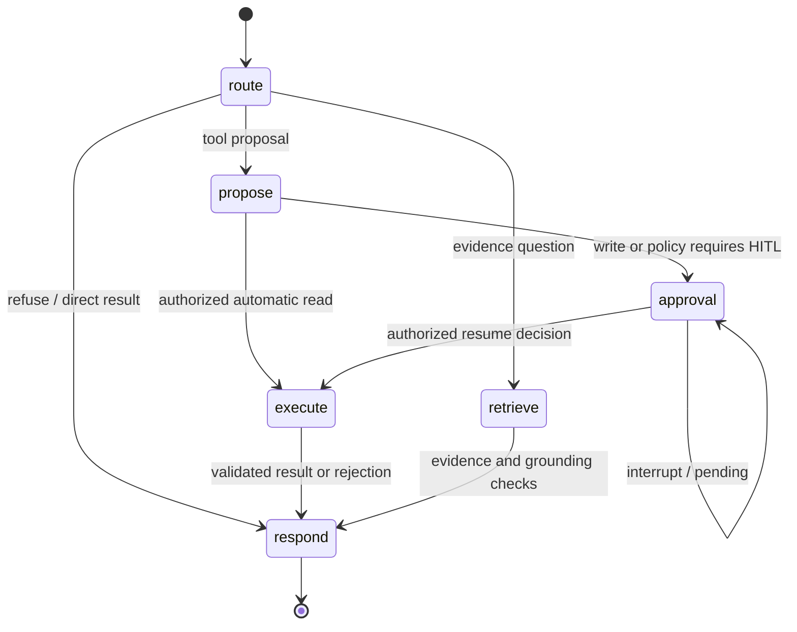
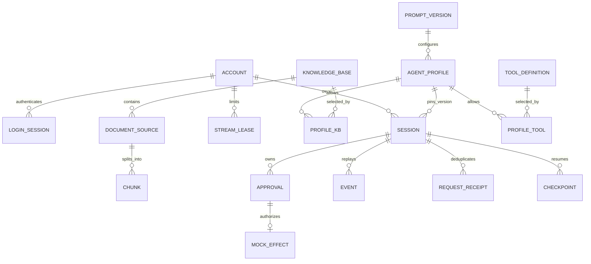

# Architecture and persistence contracts

`omniagent.application:create_app` is the v1 entry point. The earlier Day examples remain regression fixtures and are not mounted as alternate v1 execution paths. A Profile is configuration; it does not construct a different business-specific Runtime.

## LangGraph state graph



Each node reloads session authority and validates the required schema, run ID, current Profile and remaining budget. LangGraph checkpoints contain domain JSON and framework checkpoint types. Provider clients, connections, keys and rendered Prompt text are constructed outside state. Invalid or missing budget fields fail closed. The graph is bounded by recursion, node, call, token, cost and active-time policies; human waiting preserves remaining time and does not renew the other allowances.

## Approval and response loss

```mermaid
sequenceDiagram
  actor U as Member
  participant API as Owned session API
  participant DB as PostgreSQL authority
  participant G as LangGraph
  participant T as Registry / HTTP adapter
  participant M as Mock effect transaction
  U->>API: Message + stable request_key
  API->>DB: Lock thread; authorize; reserve budget
  API->>G: Invoke one bounded graph
  G->>DB: Persist proposal + ApprovalRequest
  G-->>API: interrupt, awaiting_approval
  API-->>U: Approval card + version
  U->>API: Edit / approve + decision_key + expected_version
  API->>DB: Recheck owner, role, Profile, tool, schema, risk, TTL
  API->>DB: Persist decision hash and approved payload
  API->>G: Command(resume)
  G->>T: Authorized call + stable approval key
  T->>M: Fixed endpoint + business payload + key
  M->>DB: Atomically commit effect and receipt
  M-->>T: Receipt
  G->>DB: Checkpoint + ordered events + result
  API--xU: Response may be lost
  U->>API: Repeat same decision or resume
  API->>DB: Match decision key, payload hash, current authority
  API-->>U: Stored result; receipt prevents another effect
```

Editing is edit-and-approve, with validation before the changed payload becomes executable. Reject and expiry resume to a rejected result without calling a write tool. Conflicting repeated keys, changed arguments, stale versions and concurrent decisions are rejected. Cancellation is serialized with execution and cannot undo an already committed effect.

The checkpoint and mock receipt are separate transactions. The guarantee is durable replay with idempotent effects in the local mock, not arbitrary distributed exactly-once execution. A real external write adapter would need an equivalent downstream contract and is outside v1 scope.

## Data relationships



This is a logical relationship diagram. `PROFILE_KB` and `PROFILE_TOOL` denote normalized repository relations; checkpoint tables are managed by the LangGraph saver. Accounts store role/Profile grants and Argon2id hashes; login rows contain only opaque-token hashes and expiry. Hash-only audit and independent effect receipts have retention semantics separate from conversation deletion.

Browser mutations cross Caddy TLS, canonical Host/Origin validation, an HttpOnly
session cookie and a session-bound CSRF check before routing. Role/Profile changes,
password changes and disabling an account revoke existing login rows. Model/embedding
attempts reserve persistent per-user/global allowances before work; the API uses a
restricted PostgreSQL role while migrations use an owner role. These public-entry
boundaries are specified in [ADR 0011](adr/0011-public-access-and-operational-boundaries.md).

Retrieval applies the permitted KB filter before text/vector ranks, deterministic top-k and RRF. Grounding validates chunk identity, source, KB, locator, checksum, exact support and coverage. Semantic cache namespaces include the entire authorized dependency version set; hits still verify current evidence. No global answer or action cache can cross the boundary.

## Event and observation flow

SSE GET uses owned persisted events and an opaque event ID with a per-thread monotonic sequence. It never invokes or resumes a graph. The UI validates and deduplicates event envelopes, reconnects with a cursor, and retains stable submission keys after network errors. Answer deltas are emitted only after the complete answer passes grounding; this is validated answer streaming, not raw model-token streaming.

OpenTelemetry spans cover API, graph nodes, LLM attempts, retrieval, tools, approvals and SQL. Context variables scope IDs to each request; exception paths close spans. SQL fingerprints omit parameters, audit stores argument/output hashes, and telemetry attributes exclude prompts and payloads. Default export is local only; metrics are bounded in-process observations, not a persistent monitoring warehouse.
