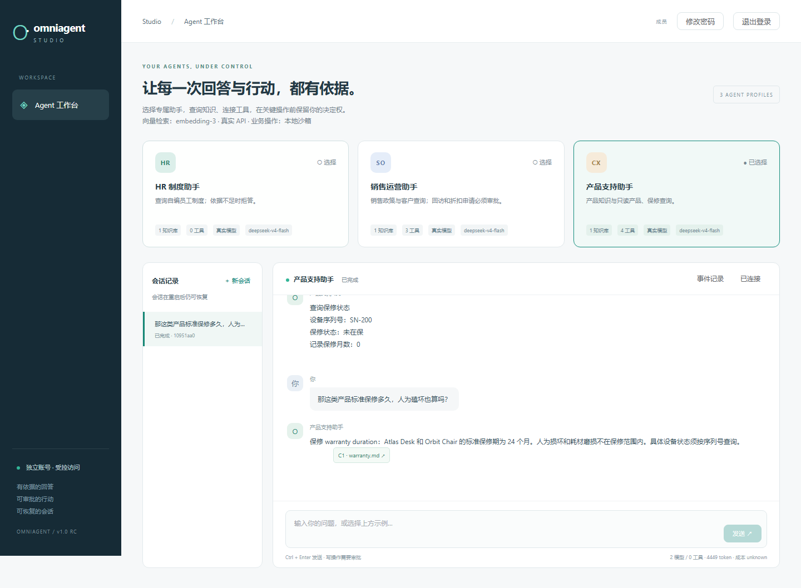
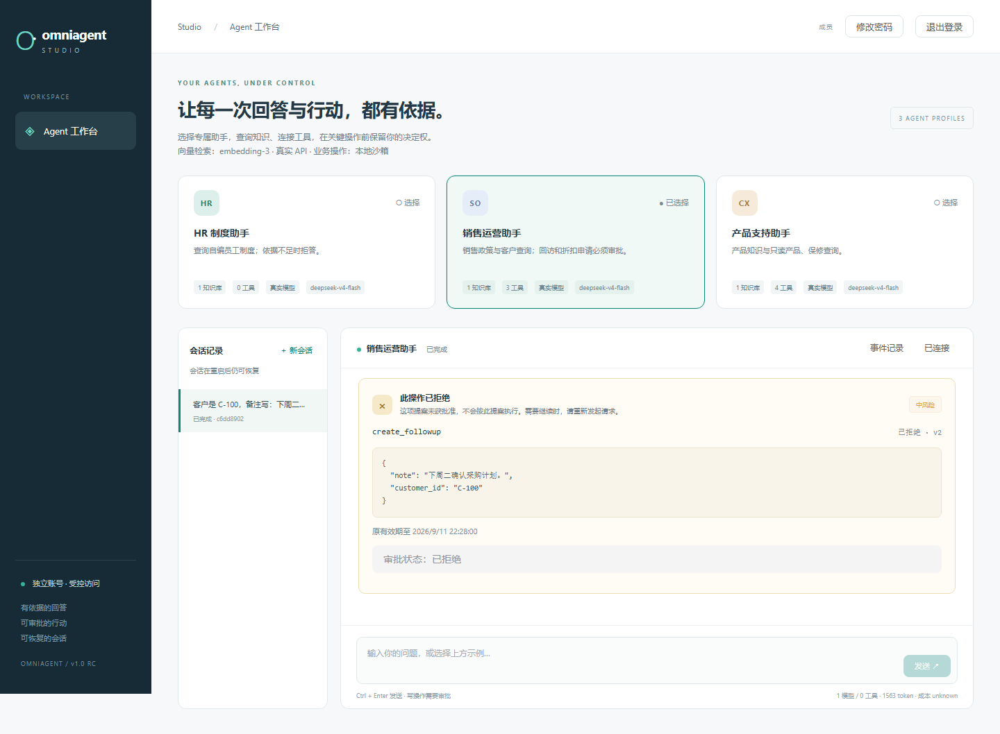

# 真实对话修复验收

应用提交：`0a798ce8df94641979de248c33efd50f80cdef0e`。本记录验证真实模型下的对话恢复与结果呈现，不代表开放问题的通用准确率。

实聊发现并修复了历史回复干扰结构化输出、澄清与拒答同时出现、失败消息重发再次调用模型、失败响应漏记用量，以及工具结果和已拒绝审批仍显示技术文案的问题。方案和取舍见 [ADR 0014](../../adr/0014-provider-protocol-and-failed-request-replay.md)。

| 验证范围 | 实际结果 |
| --- | --- |
| 后端全量测试 | 833 通过，0 跳过 |
| 前端 lint、typecheck、unit、build | 通过；40 项单测 |
| Ruff、格式检查、mypy、diff 检查 | 通过 |
| 安全回归 | 119 项通过；发布文件与 Git 可达历史扫描无发现 |
| 冻结真实模型评测 | 37/37，其中业务 30 条、对话 7 条 |
| 冻结 Fake 评测 | 77/78；保留 `hr-08` 的保守拒答偏差 |
| 真实连续对话 | 独立部署和日常 8080 部署各 13 条通过；重复请求未增加模型用量 |
| 真实页面复测 | 三段共 11 条；引用、补参、切题、工具结果、历史刷新、拒绝后继续查询通过 |
| 部署镜像检查 | 228 个应用文件，0 项发现；应用容器非 root |

真实评测的未授权写入、跨知识库命中和攻击成功均为 0，分母和分项结果见 [real-eval.json](real-eval.json)。串行工作流 P50 为 1.918 秒、P95 为 2.741 秒；54 次模型调用消耗 99,327 token，价格未知。格式契约增加了输入开销，本次不宣称性能或成本优化。

机器可读记录：[门禁与指标](verification.json)、[连续对话](conversation-smoke.json)、[实际页面问答](browser.json)。GitHub 门禁以对应提交的 Checks 为准。曾有一条浏览器断言仍等待英文 `created`；后续测试提交改为验证中文呈现，同时检查业务记录仍为 `created`，保留重复审批只执行一次的断言。





复现命令（在仓库根目录，真实模式需要操作者配置的两项凭据）：

```sh
python scripts/ops.py bootstrap --mode real --project omniagent-clean-live --port 8081 --test-accounts
python scripts/conversation_smoke.py --project omniagent-clean-live --base-url http://127.0.0.1:8081 --output .pytest-tmp-conversation
python scripts/ops.py eval-real --mode real --project omniagent-clean-live
```

固定脚本之外，交付流程还要求工程师实际试聊，修复新发现的问题后再复测。测试只使用自建会话和沙箱数据；本轮额外创建的测试账号已停用。历史失败记录不改写为成功，旧用户会话和账号不重置。真实模型仍可能产生新错误，服务端的校验、权限、预算和审批边界继续生效。
