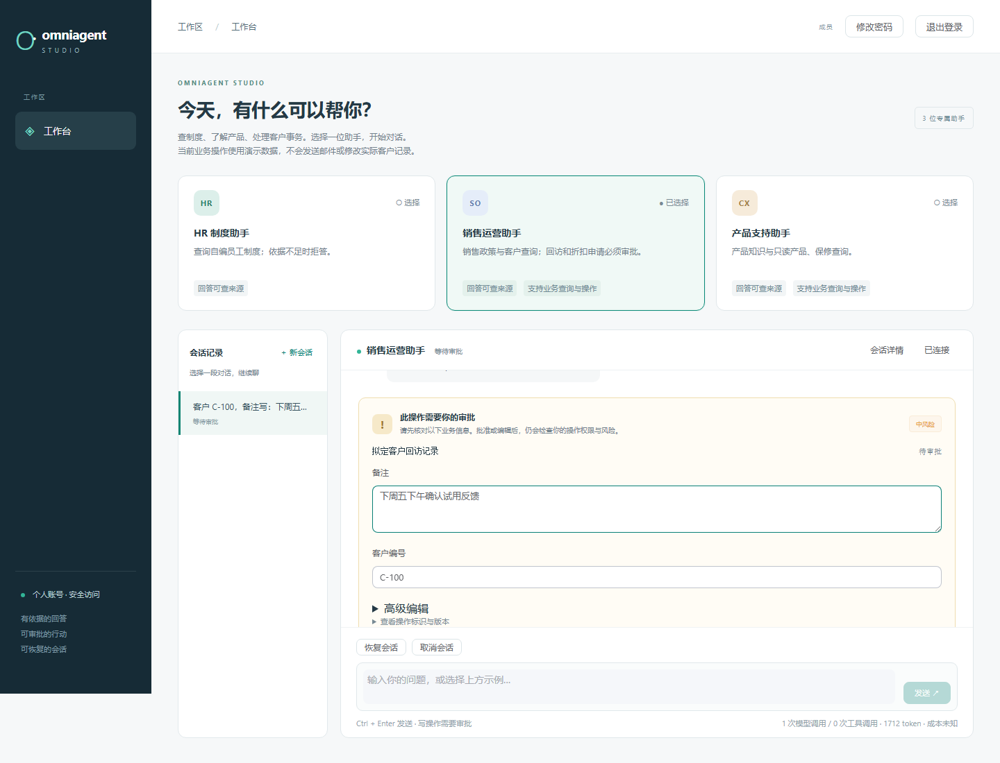

# 引用与业务表单界面验收

应用提交：`054c1e009452d666cea840554d41018a3116ba17`。

引用以章节、来源文件、可用页码和原文片段呈现，不再直接渲染切块元数据。文档内容按纯文本展示，并覆盖加载、失败重试和切换会话时的过期响应。普通工作台去除模型协议和版本宣传文案，保留输入框旁的调用次数、token 与成本统计；价格未知时明确显示“成本未知”。审批默认使用中文字段表单，完整原始数据和高级编辑仍可按需展开，提交继续使用服务端权限、版本和幂等检查。

第一轮实际试聊发现缺参澄清仍使用 `customer_id` / `note`，以及执行回执编号直接进入主聊天。修复后，路由合同提供各工具参数的业务名称，JSON 参数键和值继续保持原样；完整执行凭证收进默认折叠的执行记录。历史候选的发现保留在本轮页面复测记录中。

本轮后端 838 项测试、119 项安全回归、前端 57 项单测、5 项浏览器 E2E 通过；Ruff、mypy、前端 lint/typecheck/build 和源码/可达历史扫描通过。后端门禁在提交前运行，已逐文件核对测试源码哈希与上述应用提交一致，具体记录见 [verification.json](verification.json)。固定 Fake 集为 77/78，保留 `hr-08` 的保守拒答偏差；独立安全门禁通过。

上述应用提交的 [37 条真实模型固定评测](real-eval.json) 全部通过，其中业务 30 条、对话 7 条；模型调用 54 次，文本用量 104,416 token，成本未知。实际页面问答与桌面/手机检查见 [browser.json](browser.json)。这两类检查不作为开放问题的通用准确率；远端门禁以对应提交的 GitHub Checks 为准。

