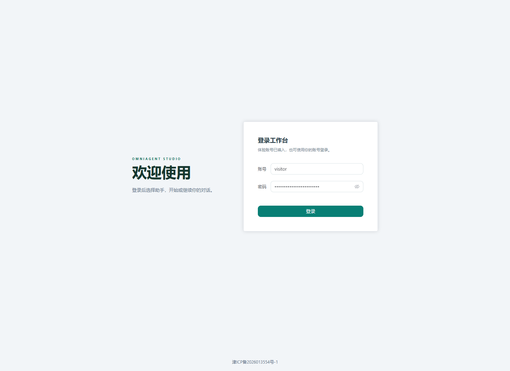
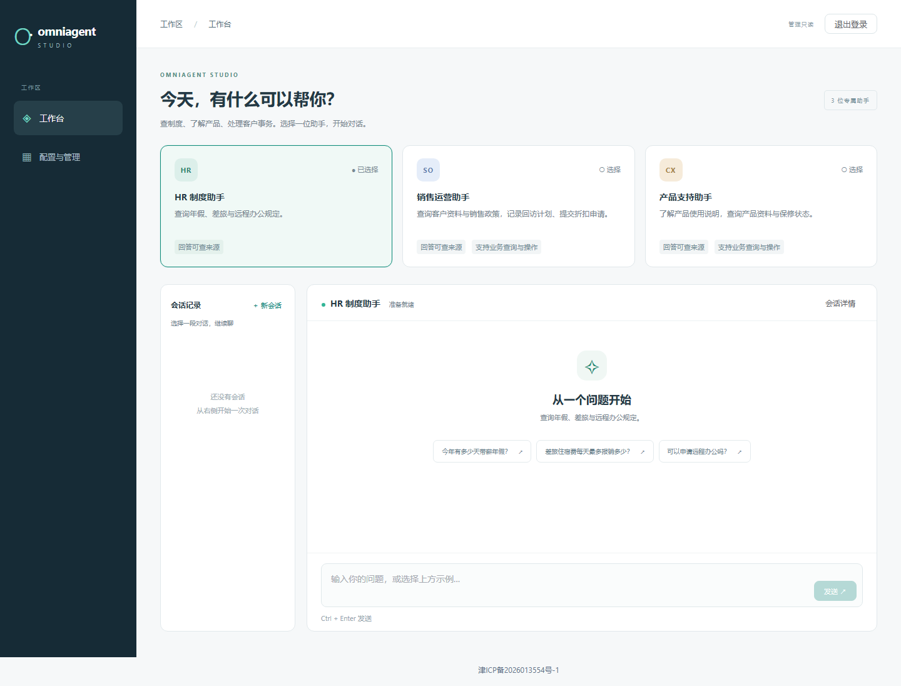

# 2026-09-21 公网上线记录

访问地址：**[https://omniagentstudio.top](https://omniagentstudio.top)**。登录页已预填访客入口，点击登录即可体验，无需安装项目或提供模型密钥。备案号 **津ICP备2026013554号-1** 已在登录页和工作台底部展示，并链接至工信部查询页。

运行应用源码为 `a8b9000e0a0619bcb044b48d1b44cbb72e8d5459`。本记录和后续文档提交不改变运行镜像；[9 月 12 日内部部署记录](cloud-deployment-2026-09-12.md) 保留原状。[构建清单](artifacts/public-launch-20260921/build-manifest.json) 记录镜像 ID 和源码标签，[验证摘要](artifacts/public-launch-20260921/verification.json) 记录本次测量范围和结果。

## 访问与展示

访客角色为“管理只读”：可以使用获授权的三个助手、查看关联配置、审批自己会话内的业务提案，不能修改助手或知识库、上传文档、管理账号或查看全站审计。每个独立浏览器首次登录建立临时身份，有效登录期间同一浏览器再次登录保留身份，不与其他浏览器共享聊天或审批权限；没有开放任意注册接口。

建议体验以下流程：

1. HR 制度助手：询问“公司福利怎么样”或“薪资待遇呢”，查看回答及引用原文。
2. 产品支持助手：询问“P-100 的保修期是多久”，再查询“设备 SN-100 的保修状态”，分别体验知识检索和业务记录查询。
3. 销售运营助手：查询客户 C-100，提出回访记录，编辑参数后批准。未批准前不执行写入，重复批准不生成第二条记录。
4. 打开“配置与管理”，查看助手、知识库、工具、提示词与模型配置；访客没有修改权限。

模型和 embedding 使用服务端配置的 DeepSeek、智谱接口；HTTP/MCP 业务工具使用本项目合成数据，未接入真实 CRM、邮件或支付系统。真实模型响应可能变化，以下检查不是对任意输入的准确性保证。

## 部署与网络

- 使用独立 production 项目、新数据库和证书卷完成迁移、seed、health；保留旧内部预览的数据与回滚镜像。
- 四个应用镜像从固定 Git 提交的归档构建，不包含未跟踪文件、私有运行目录或密钥；均以非 root 用户运行。服务器上的源码和运行镜像 ID 已与清单逐一核对。
- DNS A 记录指向 ECS；没有 AAAA。公网 TLS 校验证书链和域名通过，HTTP 返回 308 跳转到 HTTPS，首页与 `/ready` 返回 200，并设置 HSTS。
- 应用公开入口为 TCP 80/443。外网探针确认数据库、API、内部预览及预装管理面板端口不能连接。SSH 仍为独立管理入口，不属于网站访问端口。
- Caddy 持久化证书与配置并负责续签；本次验证的是当前有效证书，尚未经历未来的自然续期周期。
- 服务由 systemd 在开机时启动。已启用每日本地加密备份、每小时 TTL 清理，并将一次加密备份复制到工作站；密钥单独保存。

## 本次实际发现并修复的问题

### 工具路由选择了不能回答问题的接口

首轮自然对话中，“P-100 的保修期是多久？”被错误路由到产品价格接口，只返回名称和价格。原因是工具名称和产品编号相关，但原工具说明没有清楚描述能力范围。

修复为通用路由约束：把工具用途和输出 schema 提供给规划器，先判断返回字段是否能回答问题，再决定工具或检索；不得为回答政策问题追问无关的设备参数。补齐默认工具描述，以条件更新升级旧默认值并保留管理员自定义配置；没有添加针对产品编号或特定问句的分支。正式 seed 更新了 7 条旧工具描述，未重复创建 Profile。

修复后的公网原问题回答“标准保修期为 24 个月”，附 support 知识库引用。额外检查了人为损坏、退货期限、价格、设备保修和显式 MCP 查询。离线真实规划器检查与完整公网回答检查分别保留，不能用前者代替后者。

### 整机重启时网络防护先于网卡地址就绪

首次整机重启发现防护单元读取网卡地址时网络尚未就绪，导致网站启动依赖失败。增加 `Wants=network-online.target` 和 `After=network-online.target`，保持防护先于 Docker 的顺序；第二次整机重启无需人工启动，HTTPS `/ready` 自动恢复。

这次整机恢复检查发生在 `0e8ce76` 应用版本；最终 `a8b9000` 复用了同一主机启动配置，另外完成服务替换、健康检查与公网业务验证，不将两次不同版本检查混为一次。

### 云镜像 Compose 插件合并配置失败

云镜像自带 Compose 2.24.1 合并三个配置层时报 environment 重复项错误。安装经官方 SHA-256 核对的 [Compose v5.5.1 插件](https://github.com/docker/compose/releases/tag/v5.5.1) 后相同配置启动成功，保留原 Docker Engine 和旧插件文件。本次没有确定项目所支持的最低 Compose 版本。

## 验证结果及范围

| 检查 | 本次结果 | 范围 |
| --- | --- | --- |
| 后端 pytest | 953 通过，0 失败、0 跳过 | Windows / Python 3.12，独立 PostgreSQL 测试库 |
| 行覆盖率 | 6702 / 7467，89.75% | 当前后端测试执行范围，不是正确率 |
| Ruff / format / mypy | 全部通过 | 321 个格式文件、92 个类型检查源文件 |
| 前端 | 72 单元测试通过；lint、typecheck、build 通过 | ICP 改动版本；最终候选未再改前端源码，并重新构建镜像 |
| 安全检查 | 178 个测试通过，0 跳过；版本化攻击库存 29 条 | 测试数量与攻击成功率分母分开统计 |
| Secret / Git 历史扫描 | 0 发现 | 可发布工作区文件及所有本地 refs 可达对象；[扫描快照](artifacts/public-launch-20260921/secret-scan.json) |
| 依赖检查 | 锁定 Python 依赖审计无已知漏洞 | 不代表所有组件不存在未知漏洞 |
| Fake 固定评测 | E2E 77 / 78；三个安全 gate 全部通过 | `hr-08` 保留安全拒答失分，不隐藏失败 |
| 真实规划器 | 6 / 6 路由检查通过 | 仅规划，不包含检索和工具执行 |
| 公网访问边界 | `public_smoke` 通过 | TLS、Cookie、Origin/CSRF、用户及 Profile 隔离、撤销 |
| 公网浏览器 | 四个用例均取得通过结果 | 最终版本首轮 2 通过、2 DNS 失败；解析恢复后仅复测失败两项，2 通过 |
| 会话与审批恢复 | 身份、历史、待审批提案保留；编辑批准后重复提交，效果记录仍为 1 条 | 整机重启前后；另核对数据库计数 |
| SSE 重连 | Last-Event-ID 返回准确后缀，最新游标后无重复事件 | 不额外调用工具或增加批准次数 |
| 备份恢复 | 加密归档恢复到隔离新库，撤销恢复库登录；原库保持不变 | 仅删除验证创建的临时恢复库，未切换正式流量 |

后端门禁在提交前冻结源码运行，测试前后哈希一致，随后以相同源码提交为 `a8b9000`；归档比对确认内容一致，Windows CRLF 按 Git 规则归一化为 LF。原始评测的 Git 字段因此记录父提交 `0e8ce76`，并包含 `local:f566b5ee95b186e3e4e545e1c3295409e53e7790dd18bfe4ee3f247efbed068a` 代码版本；没有重写原报告，也不将本地结果描述为 GitHub Actions 已通过。

最终加密备份大小为 506,632 字节。隔离恢复结果为 3 条会话、41 条 checkpoint、3 条效果记录、0 条审批记录；待审批跨重启恢复由单独的整机重启探针验证，不以这份没有待审批记录的备份代替该检查。

Fake 评测中的未授权写入率、跨知识库命中率、攻击成功率均为 0，分别按当前数据集与攻击子集统计。检索 Recall@1/3/5 为 0.7391 / 0.9565 / 0.9565，MRR 为 0.8478；它们不是公网真实模型的通用效果指标。

另一次固定 Fake benchmark 为 20 次串行成功请求，P50 266.41 ms、P95 322.77 ms。计时只包括进程内 TestClient 的消息 POST，不包括公网、浏览器、创建会话或人工等待，也不是并发容量测试。真实模型价格没有配置时成本继续显示 unknown。

## 原始失败记录如何处理

- 最终浏览器首轮两条在登录后的 `/api/auth/me` 请求出现本机 `ENOTFOUND`；系统和 Node DNS 恢复一致后，仅对这两条显式复测一次。没有开启自动重试，也没有删除首轮失败结果。
- 公网六问探针最初有两个错误断言：把仓库规定的 30 天退货误写为 7 天，以及在未指定传输方式时只接受 HTTP 产品查询、排除具有相同能力的授权 MCP 查询。保留原 4 / 6 自动判定，对照版本化知识和工具契约审阅同一批响应，六条实际回答均满足业务要求；没有额外调用模型来刷通过率。
- 重启探针最初把审批版本增量误认为 1，实际批准和执行各增加一次。保留原断言失败，修正后通过只读快照验证版本与重复批准行为，没有再次执行写操作。
- 匿名打开登录页时 `/api/auth/me` 的 401 是身份探测的预期结果，单独记录；截图检查没有 JavaScript 异常或其他意外 console 错误。

## 运维边界

本次交付可用于公开访问和求职展示，仍是单实例系统，没有高可用或大规模并发承诺。自动异地备份、外部故障告警和 MFA 尚未实现；一次人工复制备份不等于持续异地保护。公网访客有独立 TTL、调用预算和每日总限额，达到限额时会限制继续使用。

本次公网账号、证书、模型密钥和备份密钥均未进入 Git。公开仓库保留脱敏摘要和截图；原始本地验证证据在受 Git 忽略的 `.local/filing-launch-20260921/`，包含初次失败与复测记录。重新部署和账号维护参考 [公网运维](public-deployment.md)，日常使用参考 [操作手册](operations.md)。
