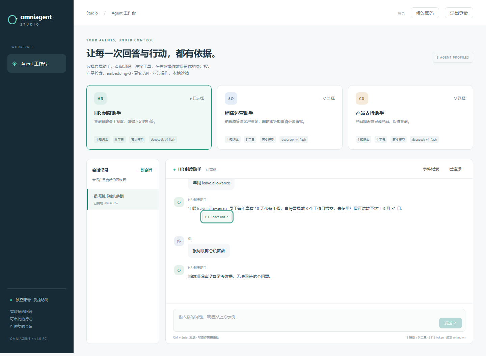
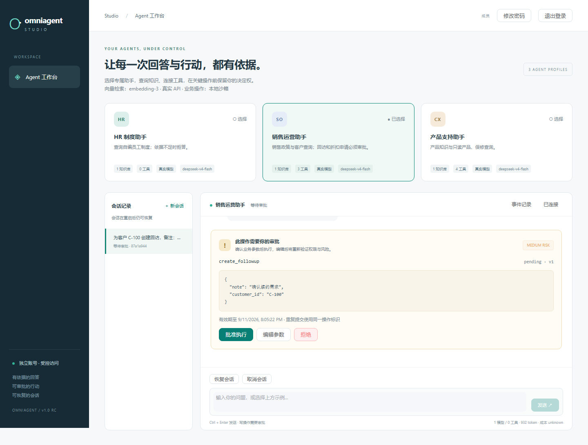
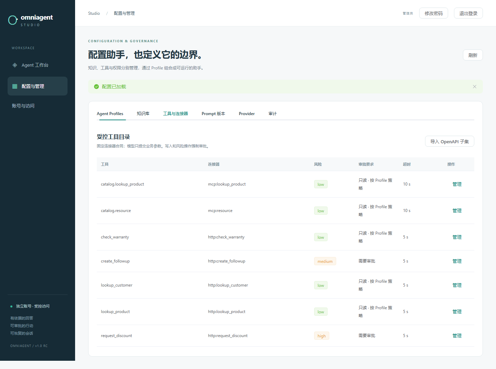

# OmniAgent Studio 项目展示

一个把知识回答和人工审批操作放进同一套 Runtime 的个人工程作品。先查看下方实际界面，再沿源码和测试入口检查实现；需要操作时使用 [Quickstart](../README.md#快速启动)。当前没有公开体验网址，本文图片来自本次修订后的干净环境真实模型部署，源码版本见 [验证记录](artifacts/portfolio-review/README.md)。

## 三个场景，一套执行逻辑

| 场景 | 可以看到的完整流程 | 关键边界 |
| --- | --- | --- |
| HR 制度查询 | 输入政策问题 → 检索 → 带原文引用回答；未知问题拒答 | 不允许业务工具，先限定知识库再检索 |
| 产品支持 | 查询产品或保修 → HTTP/MCP 只读调用 → 展示结果 | 固定端点、参数 Schema、Profile allowlist |
| 销售运营 | 查询客户 → 创建回访或申请折扣 → 参数编辑和审批 → 执行回执 | 未批准不写入，重放使用同一个幂等回执 |

### 引用与知识问答

HR 使用独立知识库。引用关联受授权的文档和片段；无证据问题不会通过编造来源补全回答。对应的权限和引用检查见下方源码入口。

### 人工审批与恢复

审批卡展示工具名称、业务参数和决策操作。待审批状态写入 PostgreSQL；刷新、重启和 SSE 重连后可继续处理。重复批准只有一次业务效果的证据来自 [恢复与重放测试](../tests/test_durable_sessions.py) 和 [本次真实验收](artifacts/portfolio-review/acceptance-real.json)。

### 管理配置

管理端提供 Profile、知识库、工具、Prompt 和账号配置。工具风险、审批要求、权限和预算在服务端统一验证；不同场景通过配置切换，不建立三套业务 Runtime。

## 源码与验证入口

| 工程问题 | 实现入口 | 验证入口 |
| --- | --- | --- |
| 多场景如何共用运行时 | [durable_runtime.py](../src/omniagent/durable_runtime.py)、[Profile seed](../presets/profiles.json) | [持久会话测试](../tests/test_durable_sessions.py) |
| 引用存在但不支持结论怎么办 | [grounding.py](../src/omniagent/grounding.py)、[grounding_runtime.py](../src/omniagent/grounding_runtime.py) | [grounding 测试](../tests/test_grounding.py)、[pipeline 测试](../tests/test_grounding_runtime_pipeline.py) |
| 检索结果怎样保持知识库隔离 | [postgres_retrieval.py](../src/omniagent/postgres_retrieval.py)、[semantic_cache.py](../src/omniagent/semantic_cache.py) | [安全矩阵](../tests/test_security_matrix.py)、[缓存测试](../tests/test_semantic_cache.py) |
| 审批编辑、并发和响应丢失如何处理 | [approvals.py](../src/omniagent/approvals.py)、[session_store.py](../src/omniagent/session_store.py) | [重启、编辑、重放及预算测试](../tests/test_durable_sessions.py) |
| HTTP/MCP 如何服从内部权限策略 | [connectors.py](../src/omniagent/connectors.py)、[mcp_tools.py](../src/omniagent/mcp_tools.py) | [MCP 测试](../tests/test_mcp_tools.py)、[安全矩阵](../tests/test_security_matrix.py) |
| 浏览器重连是否会再次执行工具 | [typed API client](../apps/web/src/api/client.ts)、[事件去重](../apps/web/src/api/events.ts) | [客户端测试](../apps/web/src/api/client.test.ts)、[事件测试](../apps/web/src/api/events.test.ts) |
| 账号与公网入口如何受控 | [架构边界](architecture.md)、[账号与部署 ADR](adr/0011-public-access-and-operational-boundaries.md) | [公网访问测试](../tests/test_public_access.py)、[TLS 验收](artifacts/release-public/tls-access.json) |

进一步阅读：[LangGraph 状态图、审批时序和数据关系](architecture.md) · [设计决策 ADR](adr/) · [威胁模型](threat-model.md) · [SQL EXPLAIN 实验](artifacts/benchmark-comparison/comparison.md)。

## 复现与证据

- **不需要模型密钥**：按 [Quickstart](../README.md#快速启动) 启动 Fake 模式，使用独立账号运行三套场景。Fake 回答仅用于离线复现。
- **真实模型演示**：服务端配置 DeepSeek 和智谱 secret 引用，按 [3–5 分钟脚本](demo.md) 操作。业务工具仍调用本地沙箱。
- **已归档验收**：[rc.3 证据目录](artifacts/release-public/README.md) 包含版本、完整指标、干净环境、两轮演示、安全及备份恢复记录。当前修改和复测结果见 [交付记录](delivery-v1.md)。
- **当前限制**：公开服务器、DNS 与证书尚未部署；评测是小型合成数据集，成本字段为 unknown，Fake 保留一条安全拒答的评测失败。见 [已知限制](failures-and-limitations.md)。

图片使用仓库已有的合成演示数据，不包含真实客户信息。重新生成图片见 [前端与截图命令](development.md#frontend-and-screenshots)；发布前应检查画面，避免包含私有账号文件、密钥、浏览器自动填充或个人文档。
