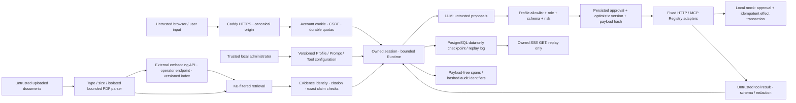

# Threat model and trust boundaries

Scope: the public v1 application in `omniagent.application`, PostgreSQL, local mock and fixed MCP child process. Earlier Day entry points are regression examples, not mounted production routes. Data and policies are synthetic. The protected local trust-boundary draft is not part of this document or the release.

The administrator, database owner and host operator are trusted. The model, browser, documents, history, summaries, citations and tool results cannot grant privileges. An attacker may control every byte of a question, document or tool response and may replay requests or disconnect after a side effect. Host compromise, a malicious database administrator, stolen authorized admin credentials and denial of service beyond this single-host deployment remain outside the application boundary.

| Threat | Enforced boundary | Evidence |
| --- | --- | --- |
| Direct injection / forged roles | UUID accounts and role/Profile grants are server-owned; user headers cannot choose roles | security matrix SEC-01–05, 13–15; eval attacks |
| Indirect document/tool instructions | Separate untrusted data messages; model output is only a proposal; server policy is repeated at execution | SEC-10/11; Registry tests |
| Cross-Profile or cross-KB disclosure | Owned thread, authorized Profile, SQL KB filter before ranking/top-k; no global retrieval | SEC-01/03/06/07; retrieval tests |
| Malicious citation | Chunk/source/KB, checksum, locator and exact text validated; UI links only owned internal citation route | grounding tests; semantic cache corruption tests |
| SSRF / redirect / DNS rebinding | Fixed approved origin/path/method/header; dial verified IP; redirects and environment proxies disabled | HTTP contract tests; SEC-12 |
| Approval forgery / replay / changed edit | Persisted owner/run/tool/policy/version; same decision key and payload required; edit revalidates schema and permissions | SEC-04/05; concurrent approval tests |
| Lost response after write | Stable approval key; local mock checks approved payload and commits effect+receipt atomically | HTTP lost-response and crash-boundary tests |
| Restart bypass of budgets | Reserve steps/tokens/dependencies before each attempt; checkpoint schema version and required budget fields; no client-supplied resume authority | durable tests; SEC-08 |
| Secret or personal data in diagnostics | No prompt, query, document, SQL parameter, stack or raw tool payload in spans; hashes in audit; known credentials/PII/reasoning redacted | redaction, concurrency and scan tests |
| Resource exhaustion | Body/upload/context/response bounds; deadlines; retry cap; SSE leases; PostgreSQL-atomic user/global model and token allowances; isolated PDF CPU/memory/wall limits | boundary and fault tests |
| Cache poisoning / stale permission | Full dependency and actor namespace; current policy and stored chunk identity checked on every hit; TTL and bounded namespace | cache tests |
| Browser script injection | Vue text interpolation; no raw HTML rendering; typed API client; CSP at web proxy | Chromium E2E and build |

`security/v1/cases.json` and `security/public-v1/cases.json` contain versioned synthetic attacks. `evals/v1/cases.json` independently includes attack cases across all three profiles. Reports give observed unauthorized-write, KB-isolation and attack-success rates separately; any nonzero value fails its own gate. A passing Fake dataset tests deterministic enforcement, not general LLM resistance to persuasion.

Secrets are resolved from operator environment or mounted file references; values do not enter Profiles, checkpoints, YAML or the browser. Real chat and embedding send authorized synthetic demonstration inputs to their explicitly configured external providers. Uploaded documents remain untrusted and require the operator to hold appropriate rights for processing. Production uses independent Argon2id accounts and hashed, revocable opaque login sessions. HttpOnly / SameSite=Strict / Secure Host cookies, exact Host/Origin and a session-bound CSRF token protect browser mutations. Role/Profile changes and password rotation revoke prior logins; active SSE rechecks access. Legacy bearer fixtures work only in explicit test mode; the serving CLI rejects that mode. Per-installation random database passwords, separated owner/runtime/mock roles and file-only secret mounts replace demo credentials. AES-GCM backups authenticate before creating a new restore database and revoke restored logins. See [public deployment](public-deployment.md) and [ADR 0011](adr/0011-public-access-and-operational-boundaries.md). There is no SSO, MFA or organization tenancy.

Session TTL blocks access and recovery; `omniagent purge` removes expired rows and LangGraph checkpoint data, login sessions, quota windows and stream leases. Explicit owned deletion also works when a Profile is disabled or a checkpoint schema is corrupt. Audit rows contain hashes and execution identifiers, while the synthetic side-effect ledger retains idempotency receipts. Erasing a conversation does not undo an executed business effect. Semantic evidence cache expires after five minutes; old cache rows are removed during writes and purge.

Known-secret pattern scanning is applied to publishable current files and all Git-reachable blobs. Ignored local environments, dependencies and private data are outside publication scanning and are excluded from Docker build context by an allowlist. Reports never print matched secret values. This pattern scanner cannot recognize every possible credential format or arbitrary personal data.

Sources: [OpenTelemetry Python instrumentation](https://opentelemetry.io/docs/languages/python/instrumentation/), [LangGraph persistence](https://docs.langchain.com/oss/python/langgraph/persistence), [LangGraph interrupts](https://docs.langchain.com/oss/python/langgraph/interrupts).
